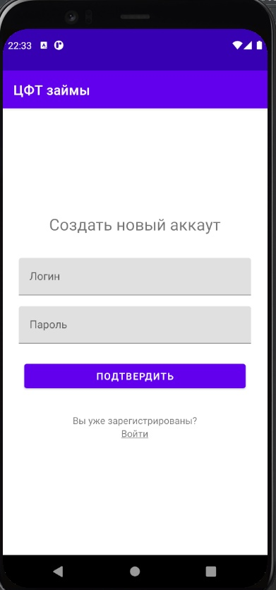
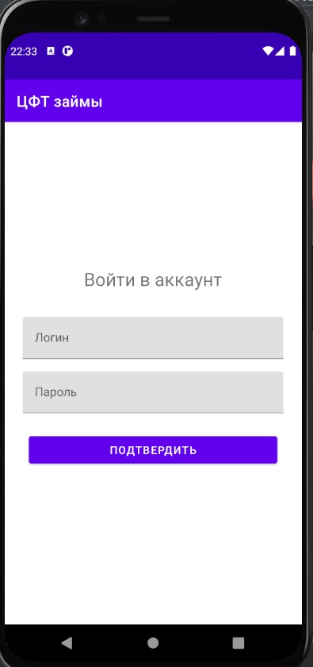
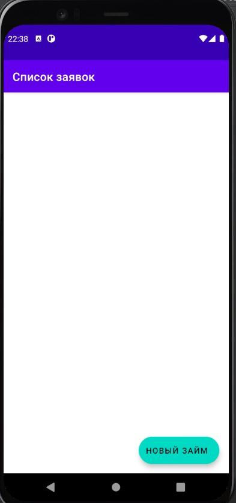
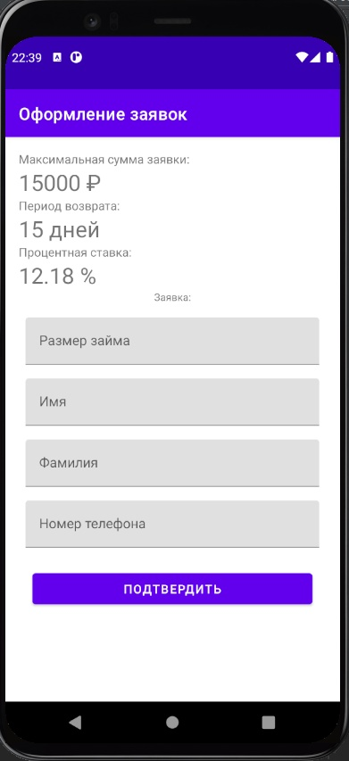
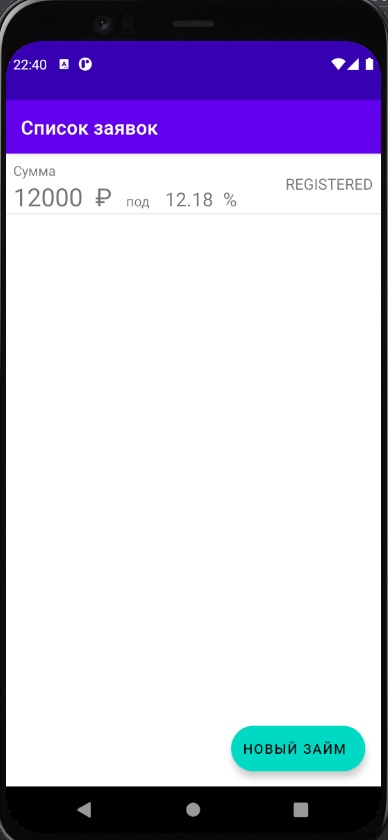
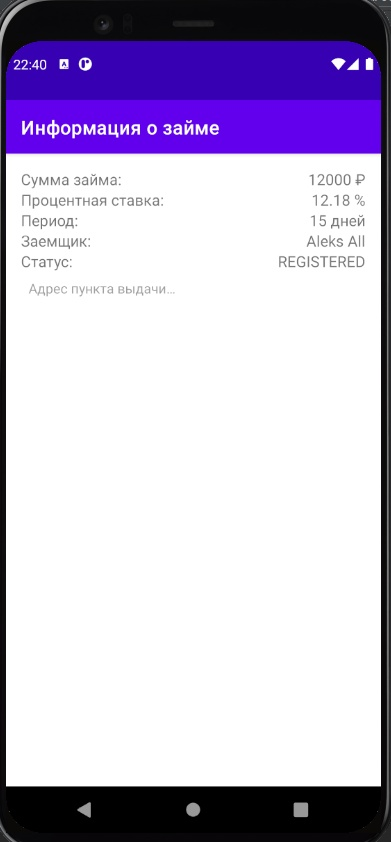

### Данный проект содержит исходный код приложения для оформления займов

### Характеристики приложения:
Приложение написано на языке Kotlin для платформы Android версии API не ниже 26 (Android 8.0).

### Работа с приложением:

Для работы с данным приложением необходимо зарегистрироваться. Для этого вам нужно ввести логин, который должен содержать более чем 4 символа, а так же пароль, которыне не должен содержать пробелов.

 

После этого вы попадете на экран со списком ваших заявок на займы. Если вы новый пользователь, то у вас экран будет пустым, нажимаем на кнопку "новый займ" в правом нижнем углу и переходим на фрагмент с условиями займа.

 

Если не устраивает предложение нажимаем на кнопку и ищем подходящие для нас условия, после того как найдем нажимаем на кнопку "подтвердить" и перемещаемся во фрагмент оформления заявки.

Заполняем данные и нажимаем на кнопку "подтвердить", после чего перемещаемся обратно на фрагмент с нашими заявками. Теперь он будет обновлен.

Так же при нажатии на саму заявку появится дополнительная информация.

